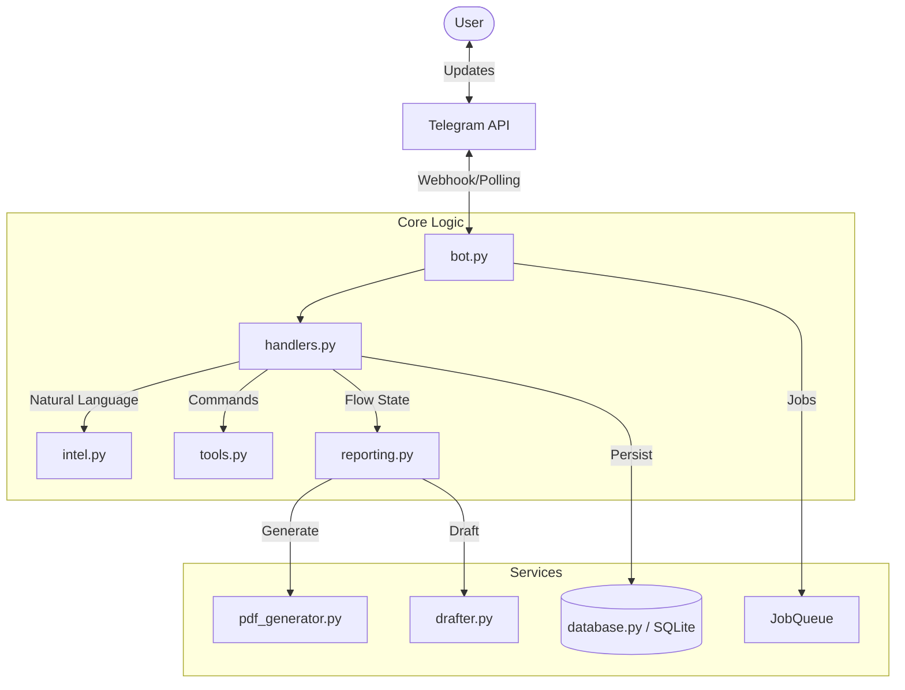

# 🛡️ CyberRescue Bot v4.5 (The Action Update)


**CyberRescue** is an advanced AI-powered Telegram bot designed not just to guide, but to **actively assist** victims of cybercrime. It automates the critical first steps of response: generating legal drafts, verifying scams, blocking banking channels, and preserving forensic evidence.

> *"Don't just report it. Resolve it."*

---

## ⚡ Key Features

### 🧠 **Smart Diagnosis & Forensic Reporting**
The bot acts as a first-responder investigator.
- **Context-Aware**: Asks specific questions based on the crime (Financial vs. Identity vs. Social).
- **Forensic PDF Generation**: Creates a detailed PDF report with timestamps, transaction IDs, and suspect details ready for police submission.

### ✍️ **Dynamic Draft Generator**
Instantly generates professional legal and banking drafts.
- **Bank Disputes**: Formal letters for unauthorized transaction disputes (RBI compliant).
- **Police Complaints**: FIR drafts with specific sections of the IT Act.
- **Social Media Appeals**: Recovery requests for hacked Instagram/Facebook accounts.

### 🔍 **ScamCheck Utility**
- verify suspicious phone numbers, UPI IDs, or URLs against known fraud patterns.
- Accessible via the **Action Center** or by sending data directly to the bot.

### 🏛️ **Bank Emergency Directory**
- Rapid access to **USSD Codes** and **SMS Blocking Formats** for all major Indian banks (SBI, HDFC, ICICI, Axis, etc.).
- Helps victims block cards within seconds of a fraud incident.

### 🔔 **Active Safety Alerts**
- **Subscription System**: Users receive daily digital safety tips via the JobQueue.
- **Intent Detection**: NLP-based system understands "I lost money" or "hacked" without needing menus.

---

## 🏗️ Architecture

The bot is built on a modular, asynchronous architecture using `python-telegram-bot` and `SQLite`.



### File Structure
- `bot.py`: Main entry point and application configuration.
- `reporting.py`: Manages the complex "Smart Diagnosis" conversation flow.
- `drafter.py`: Template engine for generating email/letter drafts.
- `intel.py`: Keyword-based intent detection engine.
- `pdf_generator.py`: FPDF-based report generation.
- `tools.py`: Utilities for scam checking and bank directory.

---

## 🚀 Installation & Setup

### Prerequisites
- Python 3.9+
- A Telegram Bot Token (from [@BotFather](https://t.me/BotFather))

### 1. Clone the Repository
```bash
git clone https://github.com/your-username/CyberRescueBot.git
cd CyberRescueBot
```

### 2. Install Dependencies
```bash
python -m venv venv
source venv/bin/activate  # On Windows: venv\Scripts\activate
pip install -r requirements.txt
```

### 3. Usage
Run the bot:
```bash
python bot.py
```

---

## 📸 Screenshots

| **Smart Diagnosis** | **Forensic PDF** |
|:---:|:---:|
| *Context-aware questioning* | *Professional detailed reports* |
|  |  |

---

## 🤝 Contributing

Contributions are welcome! Please fork the repository and submit a Pull Request.

1. Fork the Project
2. Create your Feature Branch (`git checkout -b feature/AmazingFeature`)
3. Commit your Changes (`git commit -m 'Add some AmazingFeature'`)
4. Push to the Branch (`git push origin feature/AmazingFeature`)
5. Open a Pull Request

---

## 📄 License

Distributed under the MIT License. See `LICENSE` for more information.

---

*Built with ❤️ for a Safer Digital India.*
